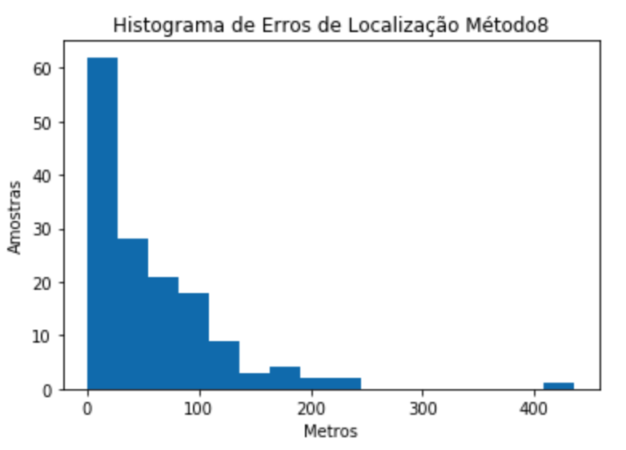
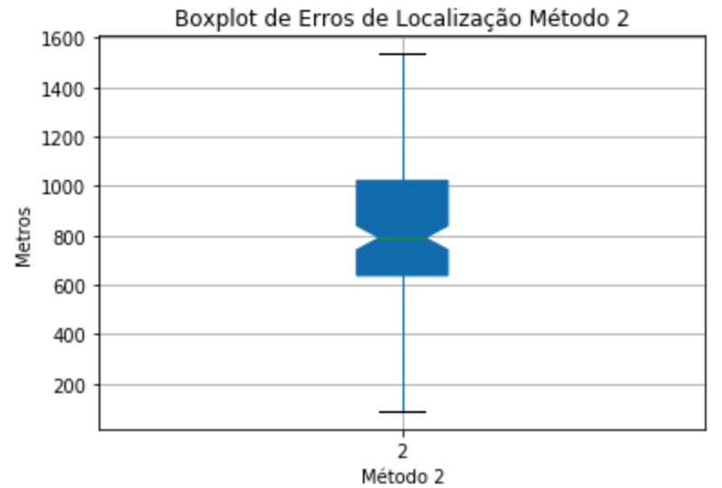
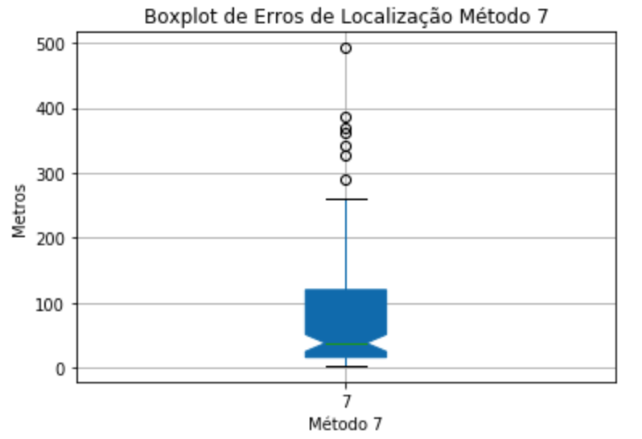
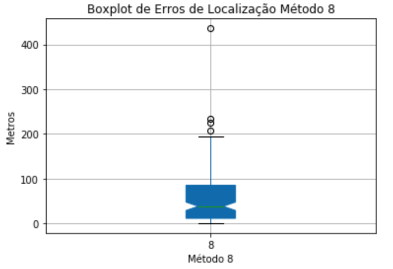
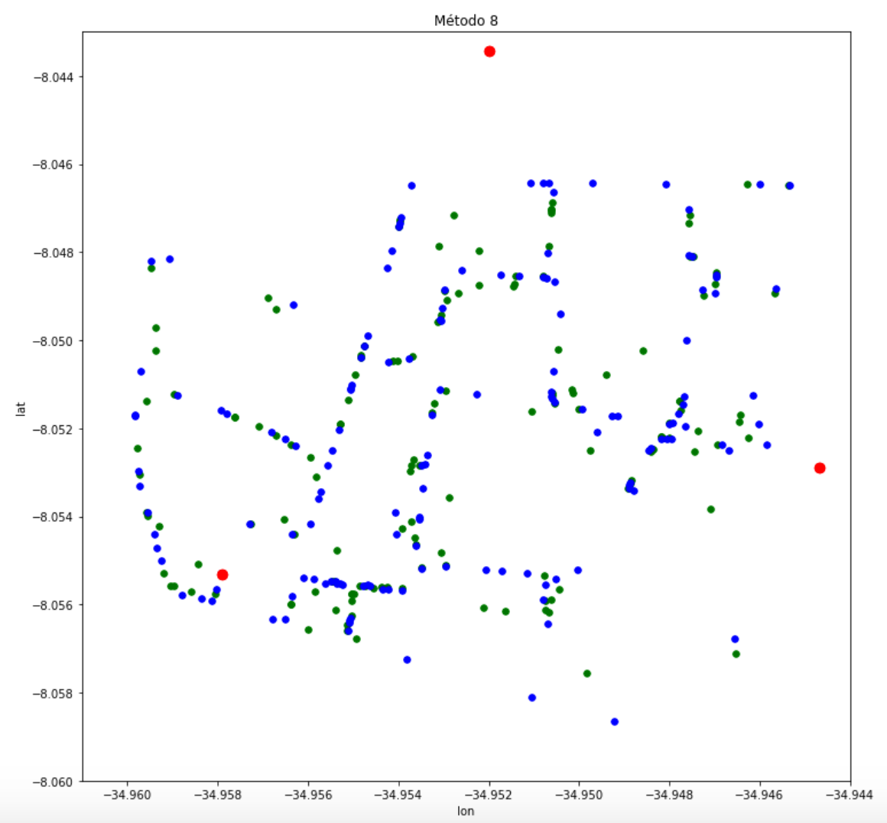
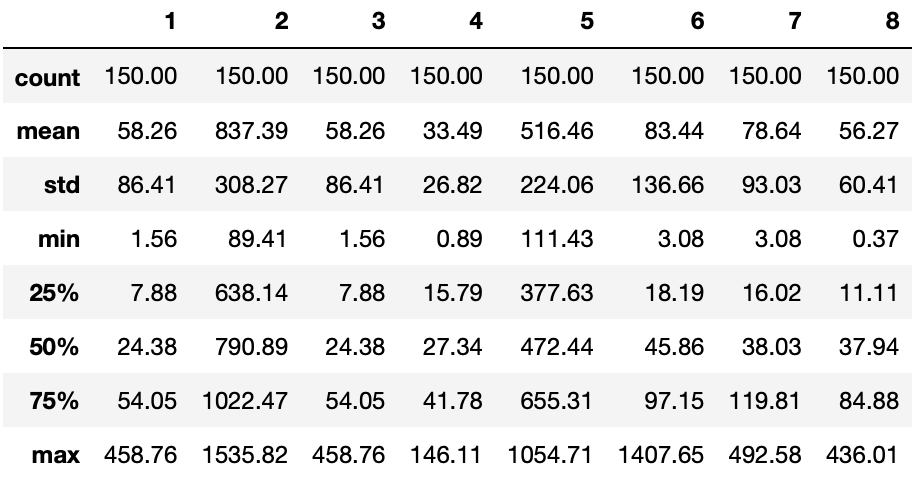

# Projeto ES290 - Comunicações Móveis
## 1. Definição do problema
Identificar a localização (latitude e longitude) de um móvel a partir da potência do sinal enviada pelas antenas (BST's) para o dispositivo móvel.
## 2. Ferramentas utilizadas
 - Python 3
 - Jupyter notebook
 - Bibliotecas de python para machine learning 
   - scikit 
   - pandas
   - numpy
   - seaborn
 - Biblioteca auxiliar de calculo de distâncias geográficas: PyRadioLoc

## 3. Solução proposta
Usar random forest para gerar fingerprints e estimar as posições (latitude e longitude) dos pontos de teste. Também comparar com uso de _Random Forest_, MLP e K-NN para previsão direta da loacalização do usuário (latitude e longitude).

## 4. Resultados

### 4.1 Análise dos dados
Da base de dadas LocTreino_Equipe_4.csv
  

### 4.2 Métodos de localização propostos
- **Baseline:** Fingerprint usando modelo de propagação Cost231Hata
- **Solução:** Três modelos de _machine learning_ para servir como modelo de propagação na geração do fingerprint e para previsão direta de latitude longitude
  - _Random forest_ 
  - _Multi Layer Perceptron_ (MLP)
  - _K-NN Regressor_
### 4.3 Histograma dos erros em metros
**Apenas Medições**  

  
  
**Apenas Fingerprint 20 x 20**  
  
  
  

**Fingerprint 20 x 20 + medições**  
  
  
  
**Random Forest**  
  
  
  
**MLP**  
  
  
  
**Fingerprint + Random Forest (sem otimização)**  
  
  
  
**Fingerprint + Random Forest (com otimização)**  
  
  

**K-NN Normalizado**  
  
  

### 4.4 BoxPlot dos erros em metros
**Apenas Medições**  
  
  
  
**Apenas Fingerprint 20 x 20**  
  
  
  
**Fingerprint 20 x 20 + medições**  
  
  
  
**Random Forest**  
  
  
  
**MLP**  
  
  
  
**Fingerprint + Random Forest (sem otimização)**  
  
  
  
**Fingerprint + Random Forest (com otimização)**  
  
  
  
**K-NN Normalizado**  
  

### 4.5 Mapa de comparação posições preditas vs. posições reais
**Apenas Medições**   
  
  
  
**Apenas Fingerprint 20 x 20**  
    
   
  
**Fingerprint 20 x 20 + medições**  
    
  
  
**Random Forest**  
  
  
  
**MLP**  
  
  
  
**Fingerprint + Radom Forest (sem otimização)**
  
  
  
**Fingerprint + Radom Forest (com otimização)**
  
  
  
**K-NN Normalizado**  
  
  
  

### 4.6 Erro de localização em metros
**Método 1:** Apenas medições  
**Método 2:** Apenas fingerprint 20 x 20  
**Método 3:** Fingerprint 20 x 20 + medições  
**Método 4:** Random forest  
**Método 5:** MLP  
**Método 6:** Fingerprint + Random Forest (sem otimização)    
**Método 7:** Fingerprint + Random Forest (com otimização)  
**Método 8:** K-NN normalizado

  

## 5. Conclusão e dificuldades
As principais dificuldades foram:  

- Implementar o modelo teórico, fingerprint
- A geração dos resultados leva parte considerável do tempo (Sugestão: uma lib que gere os gráficos e resultados de uma única vez poderia ajudar)
- Tratamento com os dados, durante um bom tempo não tinhamos percebido que devíamos usar a dist (KM) para avaliar o algoritmo
- Modelos de machine learning são complexos e a escolha dos parâmetros que vai definir a qualidade do resultado. A função de grid do scikit, apesar de bastante útil, leva bastante tempo para encontrar os melhores modelos o que a torna impraticável para aplicar sobre todos os modelos.
- O fingerprint não foi efetivo em prever as localização, pois o modelo de propagação não leva em conta antenas setoriais (azimute), apenas leva em conta latitude e longitude.
  
Analisando os dados pode-se concluir que os melhores modelos foram o Random Forest e K-NN normalizado. Pode-se notar também que o uso de machine learning para gerar o mapa de propagação de rádio obteve resultados superiores em comparação ao modelo teórico de propagação.
